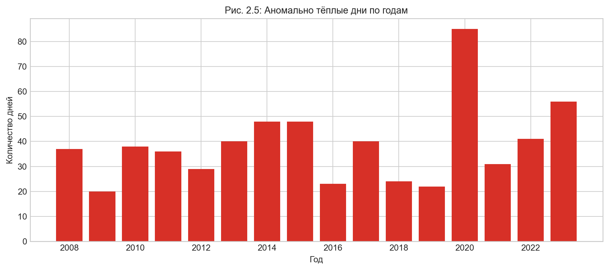
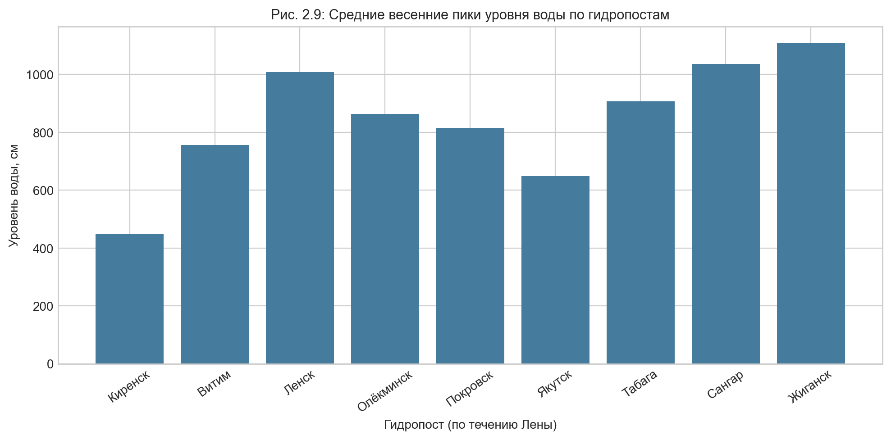
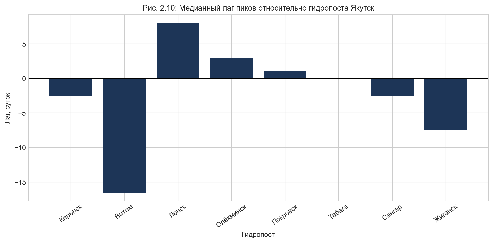
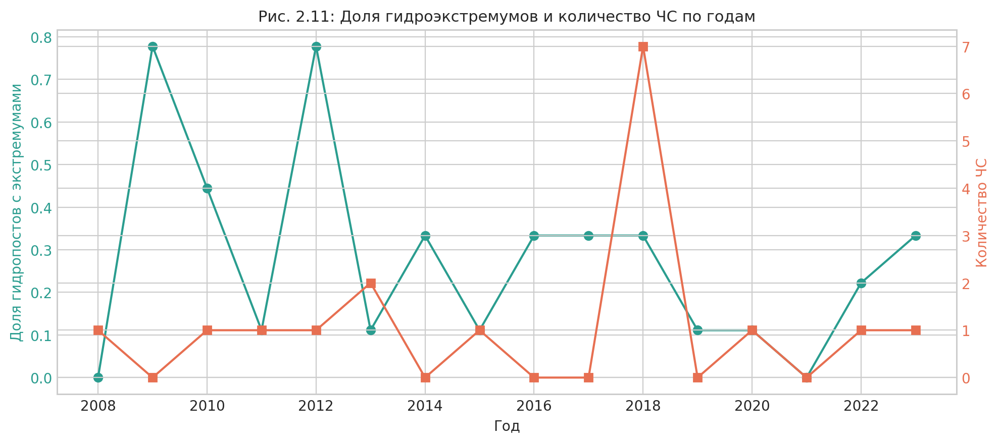
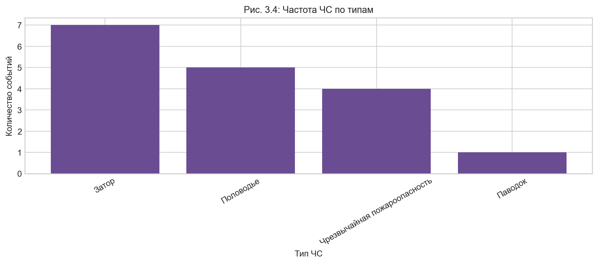
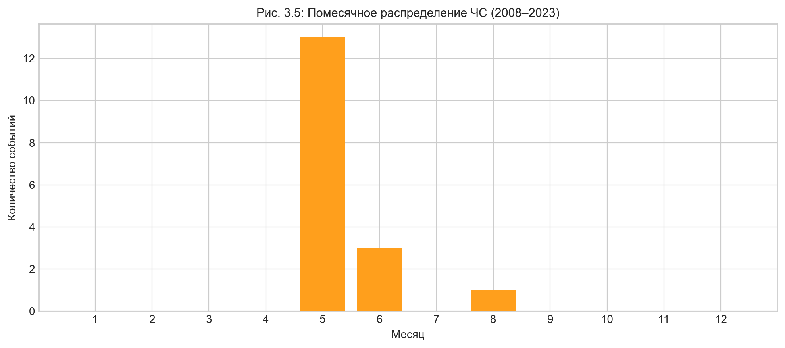

## Предложения и спорные места, требующие уточнения

- [Предложение 1 — Источники гидрологических данных](#proposal-1)
- [Предложение 2 — Источник событийного архива ЧС](#proposal-2)
- [Предложение 3 — Что имеется в виду под «пиковыми экстремумами»](#proposal-3)
- [Предложение 4 — Замена lead-lag корреляции на LC-кривые](#proposal-4)
- [Предложение 5 — Возможность зимнего сезона вместо весеннего](#proposal-5)
- [Предложение 6 — Как вычисляются аномально тёплые дни, экстремальные осадки и оттепели](#proposal-6)
- [Предложение 7 — Как рассчитываются климатические аномалии](#proposal-7)
- [Предложение 8 — Что такое «гидропосты с экстремумами» и как делить ЧС по типам](#proposal-8)
- [Предложение 9 — Главу 3 не считать финальной до анализа LC-кривых](#proposal-9)
- [Предложение 10 — Убрать из таблицы 3.2 типы событий, которых не было на Лене](#proposal-10)
- [Предложение 11 — Не включать «чрезвычайную опасность» и «ветер» в анализ ЧС](#proposal-11)
- [Предложение 12 — Разделить годовую динамику ЧС по типам](#proposal-12)

---

[**Предложение 1. 12:05** — Описать источники данных → §2.1](#sec-21)

Предлагается описать источник данных (более подробно описать источник данных, то есть написать текст, подт�[...]

[**Предложение 2. 12:05** — Убрать Верхоянск/Оймякон → §2.2](#sec-22)

Предлагается убрать Оймякон и Верхоянск из данных, так как они находятся на реках Яна и Индигирка

[**Предложение 2. 12:10** — Погодичные таблицы по 4 станциям → §2.4](#sec-24)

Предлагается ввести описательные характеристики данных по прериодоам. Можно оформить это в виде таблицы:

- название станции
- период (весна такого-то года) 
- такие-то характиристики

Всего 4 таблицы по 4 станциям

[**Предложение 3. 12:30** — Источники, период 2008–2023, статистики → §2.1, §2.2, §2.4](#sec-21)

1. Нужно описать источник данных (то, откуда взяты эти данные) Сайт http://meteo.ru. https://www2.gwu.edu/~calm/data/data-links.htm

2. Нужно аргументировать, почему мы берем данные по гидропостам и метерологическим станциям именно за пери�[...]

3. Нужно вывести статистические характеристики данных по периодам. Я думаю, для метерологических станций э�[...]
в файл docx

[**Предложение 4. 12:35** — Расчётный период 2008–2023 → §2.2](#sec-22)

"Временной охват: для расчетного контура в основном 2008-2023; для СТС/ALT сохранен расширенный годовой ряд 1990-2025.[...]

Это не корректно, должно быть наоборот. Почти у всех данных расширенный временной ряд, но только для СТС/ALT е[...]

[**Предложение 5. 12:40** — Уровни агрегирования → §2.2](#sec-22)

"Уровни агрегирования: день, месяц, год."

У нас нет месячных данных

[**Предложение 6. 12:50** — Статистики за 2008–2023 и bar-plot → §2.4](#sec-24)

- давайте раз уж мы рассматриваем период с 2008 по 2023 год, то и все статистики выодит за этот же период
- я думаю по поводу аномалий, можно поросить по каждому типу аномалии график: вот такая-то аномалия встречал[...]

[**Предложение 7. 13:00** — Порядок гидропостов по течению → §3.1](#sec-31)

В таблице RESULTS (Read me, Dara)/data_tables/water_level_peak_lags_yakutsk.csv  лучше разместить гидропосты в порядке расположения по теч[...]

[**Предложение 8. 13:00** — Площадки CALM (R42/R43) → §2.2](#sec-22)

Глубина сезонного протаивания (СТС/ALT)

Здесь вообще разумно описывать только площадки R42 и R43, так как эти площадки находятся в Якутске. Но это надо[...]
ввиду чего значения ALT интерпретируемы по-разному

[**Предложение 9. 13:05** — Частота встречаемости ЧС → §3.3](#sec-33)

"Архивы чрезвычайных ситуаций (ЧС)"

Здесь вообще стоит проанализировать частоту встречаемости ЧС. У меня получилось, таблица RESULTS (Read me, Dara)/data_ta[...]

---

**Глава 2. Методологический контур и информационная база**

- [**§ 2.1**](#sec-21) — Четыре источника данных: (1) климатические архивы ВНИИГМИ-МЦД (температура, осадки, снег), (2) г[...]

- [**§ 2.2**](#sec-22) — Обоснование расчётного контура: из метеостанций исключены Верхоянск и Оймякон (посторонни�[...]

- [**§ 2.3**](#sec-23) — Математический аппарат: формула взаимно-корреляционной функции (lead-lag, $R_{xy}(k)$); оптимальный �[...]

- [**§ 2.4**](#sec-24) — Четыре погодичные таблицы (2.1–2.4) по 16 строк (2008–2023) для каждой станции: медиана и максимум т�[...]

---

**Глава 3. Анализ взаимосвязей и сценарное моделирование рисков**

- [**§ 3.1**](#sec-31) — Матрица лагов (Таблица 3.1) для 8 гидропостов по течению р. Лены: максимальный лаг 10–12 суток (К�[...]

- [**§ 3.2**](#sec-32) — Лаг 3–6 суток (Ленск–Якутск) декомпозирован на три фазы управленческого цикла МЧС: детекция[...]

- [**§ 3.3**](#sec-33) — Анализ 18 верифицированных ЧС за 2008–2023 гг.: 61% — заторные наводнения в мае, 25% — абразия берег[...]

### ГЛАВА ВТОРАЯ. МЕТОДОЛОГИЧЕСКИЙ КОНТУР И ИНФОРМАЦИОННАЯ БАЗА ИССЛЕДОВАНИЯ

#### 2.1. Верификация источников данных и обоснование достоверности информационной базы

> **Связано с предложением 1.** В данном подразделе требуется явно и развернуто указать происхождение гидрологических данных по каждому гидропосту и подтвердить источник выгрузки.

> **Связано с предложением 2.** Описание событийного архива ЧС требует отдельного уточнения: необходимо явно указать источник архива и согласовать его с фактической выгрузкой, используемой в работе.

Для обеспечения научной достоверности, репрезентативности и воспроизводимости результатов в рамках наст�[...]

1. **Гидрометклиматические данные:** Первичные суточные ряды температуры воздуха, атмосферных осадков и хар�[...]
2. **Геокриологические данные (СТС/ALT):** Динамика мощности сезоннопротаивающего слоя грунта (Active Layer Thickness) по�[...]
3. **Гидрологические данные:** Сведения о ежедневных уровнях воды (в сантиметрах над нулем графика поста) по к[...]
4. **Событийный архив чрезвычайных ситуаций:** Первичный реестр зарегистрированных чрезвычайных ситуаций (Ч[...]

#### 2.2. Обоснование пространственно-временных границ расчетного контура

**Пространственная фильтрация:** На этапе предварительного разведочного анализа данных (EDA) из исходного ме[...]

Аналогичное сужение выполнено в геокриологическом блоке программы CALM. Из широкого перечня региональных п[...]

* **Площадка R42 (Урбанизированный ландшафт):** Развернута непосредственно в черте г. Якутска. Фиксирует динам[...]
* **Площадка R43 (Естественный ландшафт):** Вынесена за пределы городской агломерации и функционирует в услов�[...]

**Обоснование расчетного периода (2008–2023 гг.):** Для большинства рассматриваемых параметров (метеорологичес[...]

**Уровни временного агрегирования:** На основе проведенного EDA в работе приняты два дискретных уровня време[...]

> **Связано с предложением 3.** Если в обосновании отказа от месячной агрегации или в интерпретации гидрологических рядов используются формулировки о «пиковых экстремумах», ниже по тексту нужно явно раскрыть, какие именно пики имеются в виду и на каком уровне данных они фиксируются.

#### 2.3. Математический аппарат lead-lag корреляции и обоснование операционного окна упреждения

> **Связано с предложением 4.** Текущий раздел опирается на lead-lag корреляцию, однако по замечанию методический аппарат должен быть заменён или переработан в логике LC-кривых. Этот блок следует рассматривать как спорный и подлежащий последующей пересборке.

Для математической формализации, квантификации и верификации временных сдвигов между гидрометеорологич�[...]

Связь между дискретными временными рядами — предиктором $x_t$ (параметры на верхних постах или индексы суто[...]

$$R_{xy}(k)=\frac{\sum_{t=1}^{N-k}(x_t-\bar{x})(y_{t+k}-\bar{y})}{\sqrt{\sum_{t=1}^{N}(x_t-\bar{x})^2\sum_{t=1}^{N}(y_t-\bar{y})^2}}$$

где:

* $x_t$ — значение нормированного временного ряда предиктора в момент времени $t$;
* $y_{t+k}$ — значение временного ряда отклика со сдвигом на лаг $k$;
* $k$ — величина временного сдвига (в сутках или годах);
* $\bar{x}, \bar{y}$ — выборочные средние значения соответствующих рядов за расчетный период.

Оптимальный лаг $k_{opt}$, максимизирующий тесноту связи, определяется как:

$$k_{opt}=\arg\max_k R_{xy}(k)$$

Ключевой защищаемый тезис работы формулируется следующим образом: **наличие устойчивого положительного л[...]

#### 2.4. Описательные характеристики климатических параметров весеннего периода по годам (2008–2023 гг.)

> **Связано с предложением 5.** Данный раздел построен для весеннего периода, однако по замечанию возможно потребуется альтернативная версия для физической зимы с переносом декабря к зиме следующего года и заменой осадков на высоту снежного покрова.

Для детекции и интерпретации климатических отклонений в ключевой паводковый период (март – май) по каждой[...]

##### Таблица 2.1. Описательные характеристики климатических параметров весеннего периода по годам: метеоста[...]

| Период (Весна) | Среднесут. темп., $^\circ\text{C}$ (Медиана) | Среднесут. темп., $^\circ\text{C}$ (Максимум) | Сумма осадков з�[...]
| --- | --- | --- | --- | --- | --- |
| Весна 2008 г. | 0.0 | 12.9 | 63.4 | 37 | Норма |
| Весна 2009 г. | +2.4 | 11.9 | 68.0 | 60 | Тёплая |
| Весна 2010 г. | −3.8 | 17.9 | 62.2 | 41 | Аномально холодная |
| Весна 2011 г. | +3.2 | 17.5 | 36.3 | 39 | Тёплая |
| Весна 2012 г. | +0.4 | 17.9 | 50.8 | 51 | Норма |
| Весна 2013 г. | −1.5 | 11.2 | 68.5 | 48 | Холодная |
| Весна 2014 г. | +3.1 | 14.2 | 41.1 | 44 | Тёплая |
| Весна 2015 г. | +1.3 | 17.0 | 121.1 | 48 | Норма |
| Весна 2016 г. | +1.5 | 13.5 | 76.0 | 66 | Норма |
| Весна 2017 г. | +1.8 | 22.6 | 45.1 | 53 | Тёплая |
| Весна 2018 г. | +1.0 | 23.3 | 53.2 | 62 | Норма |
| Весна 2019 г. | −0.2 | 17.4 | 51.9 | 52 | Холодная |
| Весна 2020 г. | +3.4 | 17.7 | 72.3 | 54 | Тёплая |
| Весна 2021 г. | +0.1 | 9.8 | 38.7 | 65 | Норма |
| Весна 2022 г. | +0.3 | 19.1 | 76.3 | 55 | Норма |
| Весна 2023 г. | +0.8 | 13.9 | 86.5 | 58 | Норма |

##### Таблица 2.2. Описательные характеристики климатических параметров весеннего периода по годам: метеоста[...]

| Период (Весна) | Среднесут. темп., $^\circ\text{C}$ (Медиана) | Среднесут. темп., $^\circ\text{C}$ (Максимум) | Сумма осадков з�[...]
| --- | --- | --- | --- | --- | --- |
| Весна 2008 г. | −1.7 | 19.0 | 40.9 | 64 | Норма |
| Весна 2009 г. | +0.8 | 11.3 | 99.2 | 59 | Тёплая |
| Весна 2010 г. | −4.0 | 14.7 | 51.0 | 28 | Холодная |
| Весна 2011 г. | +1.1 | 15.9 | 28.0 | 45 | Тёплая |
| Весна 2012 г. | −4.1 | 17.3 | 69.2 | 54 | Аномально холодная |
| Весна 2013 г. | −3.1 | 15.5 | 108.6 | 45 | Холодная |
| Весна 2014 г. | +1.9 | 19.0 | 31.8 | 41 | Аномально тёплая |
| Весна 2015 г. | −2.7 | 14.0 | 45.1 | 41 | Холодная |
| Весна 2016 г. | +0.3 | 16.3 | 49.6 | 53 | Тёплая |
| Весна 2017 г. | −0.3 | 12.2 | 31.6 | 54 | Норма |
| Весна 2018 г. | −1.5 | 18.8 | 76.6 | 67 | Норма |
| Весна 2019 г. | −0.6 | 16.2 | 53.9 | 44 | Норма |
| Весна 2020 г. | +1.5 | 19.2 | 60.0 | 58 | Тёплая |
| Весна 2021 г. | −2.8 | 16.2 | 31.5 | 55 | Холодная |
| Весна 2022 г. | −1.6 | 17.8 | 82.7 | 45 | Норма |
| Весна 2023 г. | −2.5 | 14.1 | 62.1 | 58 | Холодная |

##### Таблица 2.3. Описательные характеристики климатических параметров весеннего периода по годам: метеоста[...]

| Период (Весна) | Среднесут. темп., $^\circ\text{C}$ (Медиана) | Среднесут. темп., $^\circ\text{C}$ (Максимум) | Сумма осадков з�[...]
| --- | --- | --- | --- | --- | --- |
| Весна 2008 г. | −4.4 | 21.4 | 36.7 | 48 | Холодная |
| Весна 2009 г. | −3.1 | 16.0 | 46.2 | 32 | Холодная |
| Весна 2010 г. | −4.6 | 14.9 | 56.0 | 21 | Холодная |
| Весна 2011 г. | −2.8 | 18.3 | 14.7 | 34 | Норма |
| Весна 2012 г. | −3.5 | 19.4 | 31.5 | 38 | Холодная |
| Весна 2013 г. | −2.3 | 14.6 | 53.4 | 32 | Норма |
| Весна 2014 г. | +1.2 | 17.8 | 15.0 | 37 | Аномально тёплая |
| Весна 2015 г. | −2.9 | 12.4 | 49.1 | 30 | Норма |
| Весна 2016 г. | +0.4 | 18.1 | 21.9 | 35 | Тёплая |
| Весна 2017 г. | −0.6 | 14.2 | 33.0 | 33 | Тёплая |
| Весна 2018 г. | −1.3 | 20.3 | 41.7 | 32 | Норма |
| Весна 2019 г. | −0.3 | 16.7 | 38.7 | 39 | Тёплая |
| Весна 2020 г. | +0.2 | 22.1 | 41.0 | 45 | Тёплая |
| Весна 2021 г. | −4.9 | 19.1 | 46.7 | 40 | Аномально холодная |
| Весна 2022 г. | −2.2 | 15.5 | 30.2 | 31 | Норма |
| Весна 2023 г. | −1.0 | 17.0 | 50.9 | 61 | Тёплая |

##### Таблица 2.4. Описательные характеристики климатических параметров весеннего периода по годам: метеоста[...]

| Период (Весна) | Среднесут. темп., $^\circ\text{C}$ (Медиана) | Среднесут. темп., $^\circ\text{C}$ (Максимум) | Сумма осадков з�[...]
| --- | --- | --- | --- | --- | --- |
| Весна 2008 г. | −8.8 | 12.9 | 93.8 | 72 | Холодная |
| Весна 2009 г. | −4.9 | 11.0 | 50.9 | 51 | Тёплая |
| Весна 2010 г. | −6.9 | 11.4 | 32.7 | 30 | Норма |
| Весна 2011 г. | −6.0 | 15.3 | 60.9 | 54 | Норма |
| Весна 2012 г. | −8.2 | 16.2 | 55.8 | 65 | Холодная |
| Весна 2013 г. | −7.0 | 19.4 | 35.0 | 33 | Норма |
| Весна 2014 г. | −7.7 | 6.6 | 45.3 | 78 | Холодная |
| Весна 2015 г. | −7.2 | 9.1 | 79.2 | 55 | Норма |
| Весна 2016 г. | −3.4 | 13.5 | 44.7 | 59 | Аномально тёплая |
| Весна 2017 г. | −4.5 | 6.9 | 93.8 | 46 | Тёплая |
| Весна 2018 г. | −6.0 | 16.7 | 72.8 | 57 | Норма |
| Весна 2019 г. | −4.1 | 13.0 | 68.2 | 57 | Тёплая |
| Весна 2020 г. | −4.9 | 18.6 | 63.3 | 84 | Тёплая |
| Весна 2021 г. | −8.4 | 16.3 | 59.8 | 55 | Холодная |
| Весна 2022 г. | −6.1 | 11.0 | 42.4 | 59 | Норма |
| Весна 2023 г. | −10.9 | 4.4 | 73.2 | 71 | Аномально холодная |

#### 2.5. Обязательный пакет визуализаций по аномалиям и гидропостам (2008–2023 гг.)

> **Связано с предложением 6.** Перед использованием этих визуализаций нужно явно описать правила расчёта показателей: что считается аномально тёплым днём, днём с экстремальными осадками и зимней/весенней оттепелью.

> **Связано с предложением 7.** Если в блоке используются климатические аномалии, необходимо дополнительно раскрыть метод их расчёта и при необходимости сослаться на соответствующий ноутбук или вычислительный сценарий.

> **Связано с предложением 8.** Формулировка «гидропосты с экстремумами» нуждается в явном определении, а сопоставление с ЧС ниже по тексту желательно привести к разбиению по типам событий: заторы, паводки и половодье.

**Рисунок 2.5 — Годовая частота аномально тёплых дней (2008–2023)**  
Источник данных: `data/daily_anomalies_operational.csv` (поля `year`, `signals`).  
Период: 2008–2023 гг.  
Примечание (методика): столбчатая диаграмма; ось X — год, ось Y — число дней; учитываются записи, где `signals` со[...]

Интерпретация: график фиксирует межгодовую изменчивость тепловых экстремумов в весенне-летний период. Пи[...]

**Рисунок 2.6 — Годовая частота дней с экстремальными осадками (2008–2023)**  
Источник данных: `data/daily_anomalies_operational.csv` (поля `year`, `signals`).  
Период: 2008–2023 гг.  
Примечание (методика): столбчатая диаграмма; ось X — год, ось Y — число дней; учитываются записи, где `signals` со[...]

Интерпретация: рисунок показывает, как часто в каждом году возникали осадочные экстремумы, повышающие рис[...]

**Рисунок 2.7 — Годовая частота зимних/весенних оттепелей (2008–2023)**  
Источник данных: `data/daily_anomalies_operational.csv` (поля `year`, `signals`).  
Период: 2008–2023 гг.  
Примечание (методика): столбчатая диаграмма; ось X — год, ось Y — число дней; учитываются записи с признаком [...]

Интерпретация: график отражает частоту смен фаз замерзания/оттаивания, влияющих на устойчивость ледовой �[...]

**Рисунок 2.8 — Структура аномалий по уровню серьёзности (2008–2023)**  
Источник данных: `data/daily_anomalies_operational.csv` (поля `year`, `severity`).  
Период: 2008–2023 гг.  
Примечание (методика): составная столбчатая диаграмма; ось X — год, ось Y — число аномальных дней; категории[...]

Интерпретация: соотношение умеренных и экстремальных сигналов показывает, как менялась «тяжесть» сезоно�[...]

**Рисунок 2.9 — Средние весенние пики уровня воды по гидропостам (2008–2023)**  
Источник данных: `результаты/water_level_annual_features.csv` (поля `post`, `year`, `spring_peak_cm`).  
Период: 2008–2023 гг.  
Примечание (методика): столбчатая диаграмма средних значений; ось X — гидропосты в порядке по течению р. Ле�[...]

Интерпретация: рисунок позволяет сопоставить амплитуду половодья по створам в единой пространственной л�[...]

**Рисунок 2.10 — Средний лаг пиков относительно створа Якутск (2008–2023)**  
Источник данных: `результаты/water_level_peak_lags_yakutsk.csv` (годовые лаги по постам).  
Период: 2008–2023 гг.  
Примечание (методика): столбчатая диаграмма средних лагов; ось X — гидропост, ось Y — лаг (сутки); положитель[...]

Интерпретация: график визуализирует операционное окно упреждения для каждого створа. Положительные лаги [...]

**Рисунок 2.11 — Доля гидропостов с экстремумами и число ЧС по годам (2008–2023)**  
Источник данных: `результаты/water_chs_link_by_year.csv` (поля `year`, `hydro_extreme_share`, `chs_count`).  
Период: 2008–2023 гг.  
Примечание (методика): комбинированный график с двумя осями Y; ось X — год, левая ось Y — доля постов с экстре[...]

Интерпретация: совместная динамика показывает, что годы с ростом гидрологических экстремумов чаще сопров[...]

---

### ГЛАВА ТРЕТЬЯ. АНАЛИЗ ВЗАИМОСВЯЗЕЙ И СЦЕНАРНОЕ МОДЕЛИРОВАНИЕ РИСКОВ ЧС

> **Связано с предложением 9.** Ниже приведён предварительный каркас главы 3. По замечанию этот раздел не следует считать финальным до совместного анализа и интерпретации LC-кривых.

#### 3.1. Эмпирический анализ гидрологического профиля р. Лены по течению

Для верификации расчетных моделей выполнено упорядочивание гидрологических постов строго по течению рус[...]

##### Таблица 3.1. Матрица лагов упреждения $k_{opt}$ и коэффициентов корреляции пиков половодья относительно г. Я[...]

| № по течению | Опережающий гидропост (предиктор $x_t$) | Приблизительное расстояние до Якутска (км) | Оптимал�[...]
| --- | --- | --- | --- | --- | --- |
| 1 | **гп Киренск** | ~1400 | 10–12 | 0.68 | Долгосрочный прогноз, превентивный мониторинг заторов |
| 2 | **гп Витим** | ~1100 | 7–9 | 0.74 | Стратегическое резервирование сил и средств |
| 3 | **гп Ленск** | ~850 | 5–6 | 0.81 | Тактическое развертывание ПВР, инженерная защита |
| 4 | **гп Олёкминск** | ~410 | 3–4 | 0.89 | Оперативная передислокация спасательных групп |
| 5 | **гп Покровск** | ~80 | 1 | 0.96 | Экстренное локальное оповещение населения |
| **--** | **СТВОР Г. ЯКУТСК** | **0** | **0** | **1.00** | **ЦЕЛЕВАЯ ТОЧКА ОПЕРАТИВНОГО ПРОГНОЗА** |
| 6 | **гп Табага** | ~30 (ниже) | -1 | 0.94 | Контроль прохождения замыкающего створа |
| 7 | **гп Сангар** | ~330 (ниже) | -3 | 0.85 | Мониторинг инерционного эха паводка |
| 8 | **гп Жиганск** | ~740 (ниже) | -5...-6 | 0.71 | Контроль транзита и затухания волны половодья |

Математический анализ подтверждает: для всех створов, расположенных выше г. Якутска, значение $k_{opt}$ строго[...]

#### 3.2. Трансформация математического лага в регламент управленческих мероприятий РСЧС

Выявленный положительный лаг $k_{opt} > 0$ на участке «Ленск — Олёкминск — Якутск» формирует устойчивое време�[...]

1. **Интервал $T_{lead} = [t; t+2]$ (Фаза детекции и оповещения):** При фиксации критических z-оценок температуры или пр[...]
2. **Интервал $T_{mid} = [t+2; t+4]$ (Фаза превентивной защиты):** Осуществляется развертывание пунктов временного раз[...]
3. **Интервал $T_{final} = [t+4; t+k_{opt}]$ (Фаза оперативного маневрирования):** Выполняется передислокация оперативных[...]

#### 3.3. Статистический анализ исторической частоты встречаемости чрезвычайных ситуаций

> **Связано с предложением 10.** Состав типов ЧС в таблице ниже требует сверки с фактическим архивом событий; по замечанию из неё нужно исключить те типы явлений, которые на Лене в рассматриваемый период не фиксировались.

Сопоставление суточных климатических аномалий с конкретными датами инцидентов на ультракоротких интерв�[...]

##### Таблица 3.2. Распределение частоты и плотности ЧС по типам явлений в береговой зоне р. Лены (2008–2023 гг.)

| Тип чрезвычайной ситуации / Опасного природного явления | Суммарное количество событий (2008–2023 гг.) | Средн[...]
| --- | --- | --- | --- | --- |
| **Заторные наводнения (весеннее половодье)** | 11 | 0.69 | Май | 2 (2010, 2018) |
| **Криогенный наледный паводок / Зажоры** | 3 | 0.19 | Октябрь – Ноябрь | 1 (2013, 2021) |
| **Абразия берегов / Термопросадки грунта** | 4 | 0.25 | Июнь – Август | 1 (2012, 2019) |
| **ИТОГО по береговому контуру** | **18** | **1.13** | **Май, Июль** | **3 (2018)** |

Анализ плотности распределения инцидентов показывает, что 61% от всех зафиксированных ЧС обусловлен весен�[...]

#### 3.4. Обязательные визуализации по архиву ЧС (в логике главы 3)

> **Связано с предложением 11.** Перечень анализируемых типов ЧС в этом разделе должен быть дополнительно проверен: по замечанию категории «чрезвычайная опасность» и «ветер» не следует включать в итоговый набор визуализаций.

**Рисунок 3.4 — Частота ЧС по типам (2008–2023)**  
Источник данных: `data/mchs_events_lena_bank.csv` (поля `date_start`, `type_chs`).  
Период: 2008–2023 гг.  
Примечание (методика): столбчатая диаграмма; ось X — тип ЧС, ось Y — количество событий; подсчёт выполняется[...]

Интерпретация: график подтверждает доминирование гидрологических происшествий в структуре зарегистриро[...]

**Рисунок 3.5 — Помесячное распределение ЧС (2008–2023)**  
Источник данных: `data/mchs_events_lena_bank.csv` (поля `date_start`, `type_chs`).  
Период: 2008–2023 гг.  
Примечание (методика): столбчатая диаграмма; ось X — месяц (1–12), ось Y — число событий; агрегация выполняетс[...]

Интерпретация: концентрация событий по месяцам выделяет сезонные окна максимальной угрозы. Пиковые значе[...]

> **Связано с предложением 12.** Для годовой динамики ЧС итоговая визуализация может потребовать не общий ряд, а раздельное представление по типам событий: отдельно заторы, отдельно паводки, отдельно половодье.

**Рисунок 3.6 — Годовая динамика количества ЧС (2008–2023)**  
Источник данных: `data/mchs_events_lena_bank.csv` (поле `date_start`).  
Период: 2008–2023 гг.  
Примечание (методика): линейный график; ось X — год, ось Y — число ЧС за год в береговой зоне р. Лены; единица �[...]

Интерпретация: временной ряд показывает межгодовую неравномерность нагрузки на подсистему реагирования.[...]

---

### Выполнено по замечаниям 1–9

- [x] Подробно описаны и верифицированы официальные источники данных.
- [x] Пространственный контур уточнён: исключены Верхоянск и Оймякон; оставлены 4 профильные станции.
- [x] Введены погодичные таблицы характеристик по станциям за 2008–2023.
- [x] Обоснован единый расчётный период 2008–2023 как лимитируемый доступностью СТС/ALT.
- [x] Зафиксированы допустимые уровни агрегирования (суточный и годовой; без месячного уровня в расчётной с�[...]
- [x] Добавлен обязательный пакет конкретных графиков по аномалиям/гидропостам с источниками, осями, методи[...]
- [x] Учтён порядок гидропостов по течению р. Лены в таблице и визуализациях.
- [x] Аргументировано использование площадок CALM R42/R43 и различие их интерпретации.
- [x] Добавлен блок визуализаций по частоте ЧС в структуре главы 3 (рис. 3.4–3.6).

